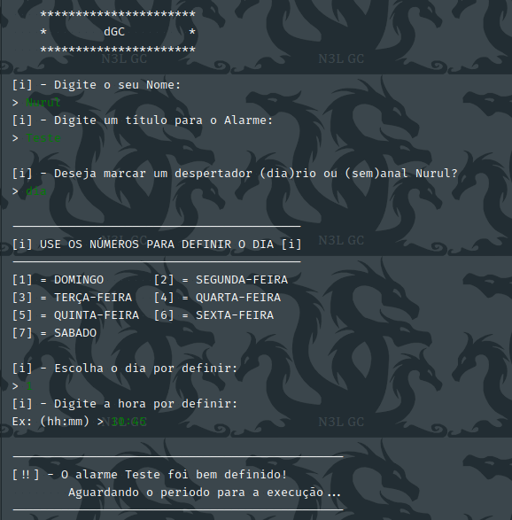
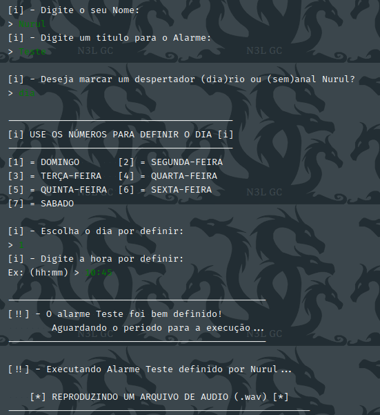

# dGC

    pequeno e simples agendador de tarefas - DespertadorGC

## Exemplos

## Requisitos

Windows:
- `pip install -r requirements.txt`

Linux:
- `python3 -m pip install -r requirements.txt`
- `sudo pip3 install -r requirements.txt`

---

&copy; 2019-2021 [Nurul Carvalho](mailto:nuruldecarvalho@gmail.com) \
&trade; [ArtesGC](https://artesgc.home.blog)
